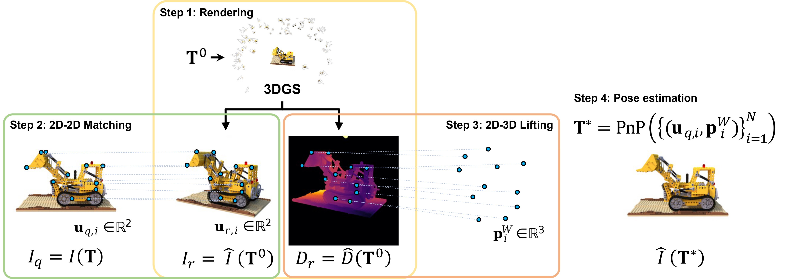
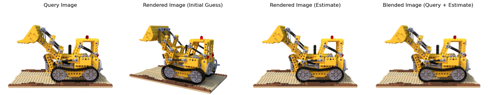
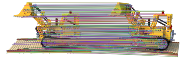
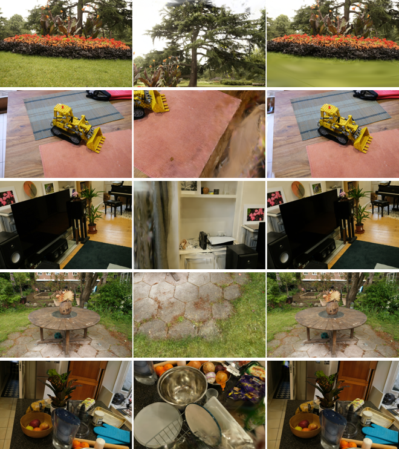
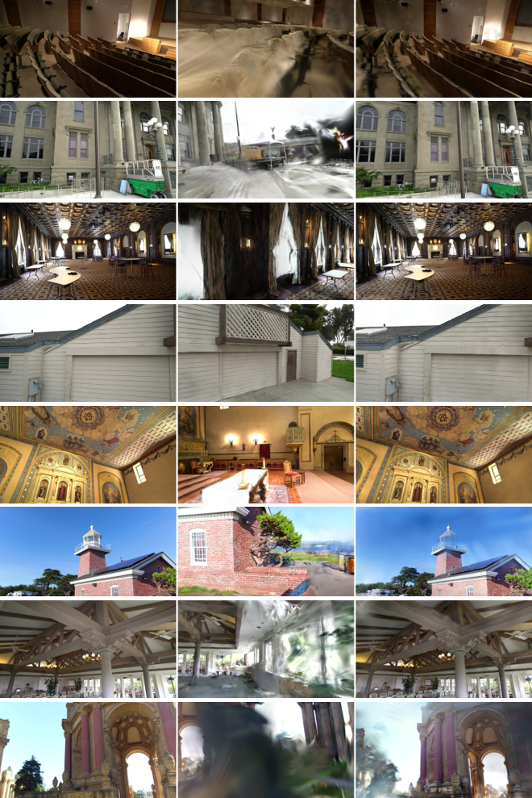

# GSFeatLoc: Visual Localization Using Feature Correspondence on 3D Gaussian Splatting

This repository contains the source code for the paper **"GSFeatLoc: Visual Localization Using Feature Correspondence on 3D Gaussian Splatting"**.
All source code in this repository is licensed under the BSD 3-Clause.

Author: Jongwon Lee (jongwon5@illinois.edu)

## Overview

We present a method for localizing a query image with respect to a precomputed 3D Gaussian Splatting (3DGS) scene representation.

- First, the method uses 3DGS to render a synthetic RGBD image at some initial pose estimate. 
- Second, it establishes 2D-2D correspondences between the query image and this synthetic image. 
- Third, it uses the depth map to lift the 2D-2D correspondences to 2D-3D correspondences and solves a perspective-n-point (PnP) problem to produce a final pose estimate.

Our method significantly reduces both inference time (**from >10s to ~0.1s**) and estimation error compared to baseline methods that use photometric loss minimization.

The figure below shows an overview of the proposed pipeline for visual localization using 3D Gaussian Splatting (3DGS) as the scene representation, given a query image Iq, an initial pose estimate T⁰ ∈ SE(3), and the 3DGS scene representation.



The figure below shows (from left to right) the query image, an image rendered at a rough initial pose, an image rendered at the estimated pose, and a blended result of the query image and the rendered image at the estimated pose.



This is enabled by establishing 2D-2D feature correspondences between the query image and the image rendered at the initial pose, as shown below. 



## How to run

### Step 0: Set up the Python environment

Assuming that [Python](https://www.python.org/) and [Conda](https://conda.org/) is installed in your environment, set up a Conda environment from `environment.yml` by running the following command:
```
conda env create -f environment.yml
```

After the installation, activate the Conda environment:
```
conda activate gsfeatloc
```

### Step 1: Construct a 3DGS of the scene

Visual localization requires a scene representation (e.g., 3DGS) as well as a query image. 
We use [gsplat](https://docs.gsplat.studio/main/), an implementation of [Gaussian splatting](https://repo-sam.inria.fr/fungraph/3d-gaussian-splatting/) that offers improved reconstruction efficiency and comparable rendering quality, while also supporting depth rendering—a feature not available in the original implementation.
We use [NerfBaselines](https://nerfbaselines.github.io/), a framework for reconstructing and interfacing with gsplat.

[NerfBaselines](https://nerfbaselines.github.io/docs/datasets.html) supports either a dataset formatted by Synthetic-NeRF (referred to as 'Blender' in this context) or a dataset formatted with COLMAP. 
The former includes a set of images—some used for reconstruction and others as query images for visual localization—along with ground-truth camera poses. The latter includes a set of images and the corresponding [COLMAP output files](https://colmap.github.io/format.html).
Assuming one of these datasets is available, you can reconstruct a 3DGS representation of the scene by running the following command:
```
nerfbaselines train --method gsplat --data ${DATASET_PATH}/${SCENE} --output ${MODEL_PATH}/${SCENE}
```

### Step 2: Perform visual localization

Once the reconstruction with gsplat is completed, the system is ready for visual localization. 
This can be performed using either (1) the Jupyter notebook `notebook/gsfeatloc-demo.ipynb` or (2) the command-line script `gsfeatloc_cli.py`.
Below is an example use case of the command-line script:
```
rot=12.10
trs=0.87
python gsfeatloc_cli.py \
    --scene_path ${DATASET_PATH}/${SCENE} \
    --model_path ${MODEL_PATH}/${SCENE}/checkpoint-30000 \
    --output_path ${OUTPUT_PATH}/${SCENE} \
    --output_filename results.json \
    --delta_rot $rot \
    --delta_trs $trs \
    --axis_mode 'random' \
    --magnitude_mode 'gaussian'
```
For details on each flag, please refer to `gsfeatloc_cli.py` or run it with the `--help` option.

## Results 

We compared our method against piNeRF and iComMa, representative open-source methods based on photometric loss minimization using NeRF and 3DGS, respectively.
We chose commonly used evaluation metrics: mean rotation error (RE), mean translation error (TE), the percentage of results with RE < 5◦ and TE < 0.05, and the mean inference time per image, where TE is normalized by scene scale.
The evaluation was conducted on open-source datasets commonly used for scene reconstruction and localization with NeRF and 3DGS: [Synthetic NeRF](https://www.matthewtancik.com/nerf), [Mip-NeRF360](https://jonbarron.info/mipnerf360/), and [Tanks and Temples](https://www.tanksandtemples.org/).

### Comparison under randomized initial poses

The tables below show the aggregated results of our method and baseline methods on three datasets.

#### Synthetic NeRF (8 scenes, 1600 test images)

|                       | **piNeRF** | **iComMa** | **Proposed**     |
|-----------------------|:----------:|:----------:|:----------------:|
| **mRE (°)**           | 3.08       | 13.29      | **1.61**         |
| **mTE (unitless)**    | 0.05       | 0.20       | **0.03**         |
| **RE<5° TE<0.05 (%)** | 71.88      | 79.00      | **90.94**        |
| **Time / Image (s)**  | 13.56      | 16.74      | **0.09**         |

#### Mip-NeRF360 (9 scenes, 221 test images)

|                       | **piNeRF** | **iComMa** | **Proposed**     |
|-----------------------|:----------:|:----------:|:----------------:|
| **mRE (°)**           | 14.36      | 2.67       | **1.63**         |
| **mTE (unitless)**    | 0.25       | **0.04**   | **0.04**         |
| **RE<5° TE<0.05 (%)** | 1.22       | 86.99      | **90.65**        |
| **Time / Image (s)**  | 13.46      | 27.78      | **0.15**         |

#### Tanks and Temples (21 scenes, 943 test images)

|                       | **piNeRF** | **iComMa** | **Proposed**     |
|-----------------------|:----------:|:----------:|:----------------:|
| **mRE (°)**           | 21.27      | 31.71      | **11.10**        |
| **mTE (unitless)**    | 0.27       | 0.38       | **0.20**         |
| **RE<5° TE<0.05 (%)** | 6.89       | 32.45      | **42.42**        |
| **Time / Image (s)**  | 14.59      | 41.79      | **0.10**         |

### Comparison under initial poses provided by 6DGS

The tables below shows the aggregated results of our method and baseline methods on three datasets with an initial pose provided by [6DGS](https://github.com/mbortolon97/6dgs). The original 6DGS results are included as a reference in the leftmost column.

#### Synthetic NeRF (8 scenes, 1600 test images)

|                       | **6DGS**   | **piNeRF** | **iComMa** | **Proposed** |
|-----------------------|:----------:|:----------:|:----------:|:------------:|
| **mRE (°)**           | 17.93      | 23.69      | 35.61      | **14.09**    |
| **mTE (unitless)**    | 0.59       | 0.52       | 0.51       | **0.27**     |
| **RE<5° TE<0.05 (%)** | 0.06       | 10.44      | 44.25      | **61.25**    |
| **Time / Image (s)**  | 0.04       | 14.62      | 29.92      | **0.09**     |

#### Mip-NeRF360 (9 scenes, 221 test images)

|                       | **6DGS**   | **piNeRF** | **iComMa** | **Proposed** |
|-----------------------|:----------:|:----------:|:----------:|:------------:|
| **mRE (°)**           | 20.84      | 17.04      | 9.60       | **6.47**     |
| **mTE (unitless)**    | 0.22       | 0.28       | 0.11       | **0.05**     |
| **RE<5° TE<0.05 (%)** | 0.41       | 2.44       | 78.46      | **90.24**    |
| **Time / Image (s)**  | 0.02       | 14.18      | 30.65      | **0.15**     |

#### Tanks and Temples (21 scenes, 943 test images)

|                       | **6DGS**   | **piNeRF** | **iComMa** | **Proposed** |
|-----------------------|:----------:|:----------:|:----------:|:------------:|
| **mRE (°)**           | 17.93      | 27.96      | 35.69      | **11.21**    |
| **mTE (unitless)**    | 0.59       | 0.23       | 0.39       | **0.08**     |
| **RE<5° TE<0.05 (%)** | 0.06       | 8.91       | 31.60      | **72.53**    |
| **Time / Image (s)**  | 0.04       | 14.88      | 45.68      | **0.11**     |


### Example success chases under challenging initial pose estimate causing drastic appearance differences between the query and the rendered image

The images below show examples of success cases from our method on several scenes from Synthetic NeRF, Mip-NeRF360, and Tanks and Temples dataset, where the success is defined as rotation error < 5deg and translation error < 0.05.
Each triplet shows, from left to right, the query image, the image rendered at the initial pose provided by 6DGS, and the image rendered at the pose estimated by our method.
Our method shows success cases despite drastic appearance differences between the query and the rendered image.





## Reference

If you use any part or all of this project or its code, please acknowledge and cite the following reference:
```
@misc{lee2025gsfeatlocvisuallocalizationusing,
      title={GSFeatLoc: Visual Localization Using Feature Correspondence on 3D Gaussian Splatting}, 
      author={Jongwon Lee and Timothy Bretl},
      year={2025},
      eprint={2504.20379},
      archivePrefix={arXiv},
      primaryClass={cs.CV},
      url={https://arxiv.org/abs/2504.20379}, 
}
```